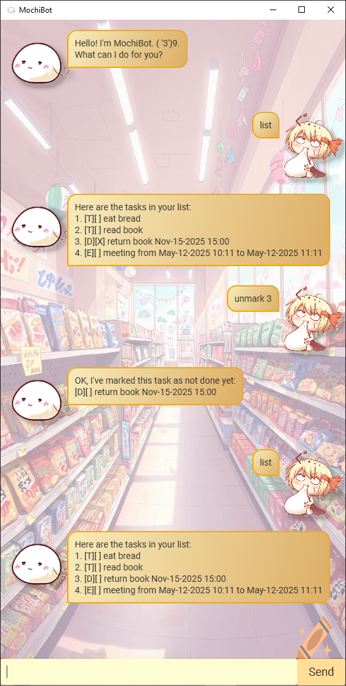

# MochiBot User Guide

MochiBot is a **desktop app for managing tasks, optimized for use via a Command Line Interface** (CLI) while still having the benefits of a Graphical User Interface (GUI). If you can type fast, MochiBot can get your task management done faster than traditional GUI apps.

## Table of Contents
- [Quick Start](#quick-start)
- [Features](#features)
  - [Adding a task: `todo`,`deadline`, `event`](#adding-a-task-todo-deadline-event)
  - [Listing all tasks: `list`](#listing-all-tasks-list)
  - [Marking a task: `mark`](#marking-a-task-mark)
  - [Unmarking a task: `unmark`](#unmarking-a-task-unmark)
  - [Locating a task by name: `find`](#locating-a-task-by-name-find)
  - [Deleting a task: `delete`](#deleting-a-task-delete)
  - [Exiting the program: `bye`](#exiting-the-program-bye)
- [Saving the data](#saving-the-data)
- [FAQ](#faq)

## Quick start
1. Ensure that you have Java `17` or above installed in your Computer.  
**Mac Users:** Ensure that you have the precise JDK version prescribed [here](https://se-education.org/guides/tutorials/javaInstallationMac.html).
2. Download the latest `.jar` file from here.
3. Copy the file to the folder you want to use as the *home folder* for your MochiBot application.
4. Open a command terminal, `cd` into the folder that you put the jar file in, and use the `java -jar mochibot.jar` command to run the application.

## Features
### Adding a task: `todo`, `deadline`, `event`
Adds a task into the list. Tasks are divided into todo, deadline and event tasks.

#### Adding a `todo` task:
Format: `todo [DESCRIPTION]`  
Examples:
- `todo read book`
- `todo study`

 

#### Adding a `deadline` task:
Format: `deadline [DESCRIPTION] [/by DATETIME]`  
- The `DATETIME` is in the format of `yyyy-mm-dd HH:mm`.  

Examples:
- `deadline return book /by 2025-12-25 22:02`
- `deadline finish project /by 2025-05-04 01:25`

 

#### Adding an `event` task:
Format: `event [DESCRIPTION] [/from DATETIME] [/to DATETIME]`  
- The `DATETIME` is in the format of `yyyy-mm-dd HH:mm`.  

Examples:
- `event book fair /from 2025-01-17 22:02 /to 2025-01-18 19:59`
- `event project meeting /from 2025-07-11 10:25 /to 2025-07-11 12:25`

 

### Listing all tasks: `list`
Shows a list of all tasks in the task list.  
Format: `list`

 

### Marking a task: `mark`
Marks a specified task in the task list as completed.  
Format: `mark [TASK INDEX]`
- Marks the task at the specified `TASK INDEX`.
- The index refers to the index number shown in the displayed task list.
- The index number **must be a positive integer** 1, 2, 3, ...

Examples:
- `list` followed by `mark 2` marks the 2nd task in the task list.

### Unmarking a task: `unmark`
Unmarks a specified task in the task list as completed.  
Format: `unmark [TASK INDEX]`
- Unmarks the task at the specified `TASK INDEX`.
- The index refers to the index number shown in the displayed task list.
- The index number **must be a positive integer** 1, 2, 3, ...

Examples:
- `list` followed by `unmark 1` unmarks the 1st task in the task list.

 

### Locating a task by name: `find`
Finds a task whose task description or date-time contains the specified keyword.  
Format: `find [KEYWORD]`
- The search is case-sensitive. e.g. `Bread` will not match `bread`.
- Both the description and the date-time can be searched.
- Partial words will be matched e.g. `bread` will match `breads`.

 

### Deleting a task: `delete`
Deletes the specified task from the task list.  
Format: `delete [TASK INDEX]`
- Unmarks the task at the specified `TASK INDEX`.
- The index refers to the index number shown in the displayed task list.
- The index number **must be a positive integer** 1, 2, 3, ...

Examples:
- `list` followed by `delete 2` deletes the 2nd task in the task list.

 

### Exiting the program: `bye`
Exits the program.  
Format: `bye`

## Saving the data
MochiBot data are saved in the hard disk automatically after any command that changes the data. There is no need to save manually.

## FAQ
**Q:** How do I transfer my data to another Computer?  
**A:** Install the app in the other computer and overwrite the empty data file it creates with the file that contains the data of your previous AddressBook home folder.
